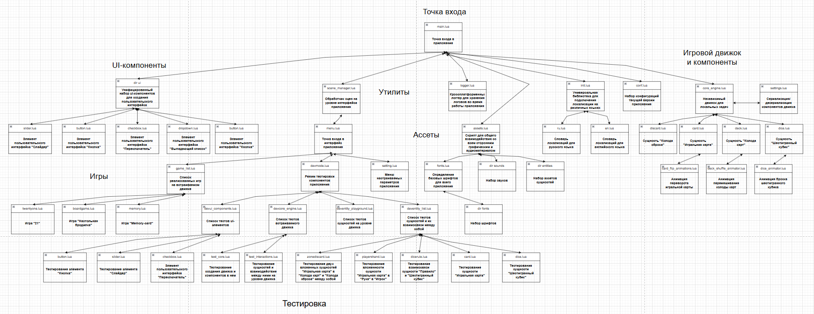
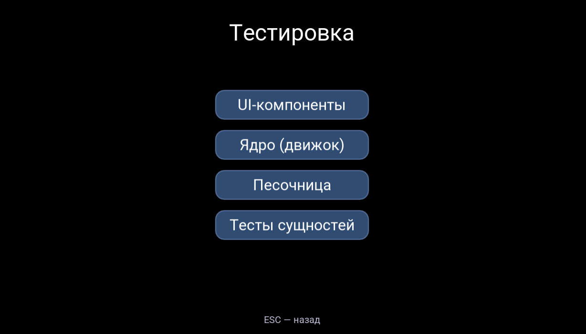

# Board Game Creator



**Кроссплатформенное приложение для создания, прототипирования и тестирования настольных игр.**  
Подходит для инди-разработчиков, педагогов, студентов и всех, кто хочет быстро создавать собственные настолки на Windows, Linux, macOS, Android и iOS.

---

## Особенности

- Лёгковесный игровой движок на Lua + LOVE2D
- Гибкая и масштабируемая архитектура (движок, UI, ассеты, тесты — независимые модули)
- Унифицированные, настраиваемые UI-компоненты (кнопки, списки, слайдеры и др.)
- Централизованное управление ассетами (шрифты, изображения, звуки)
- Поддержка локализации (многоязычность)
- Кроссплатформенное логирование
- Полная система тестирования для всех компонентов
- Нет внешних зависимостей

---

## Скриншоты



---

## Быстрый старт

1. Установите [LOVE2D](https://love2d.org/) (рекомендуется версия 11.4+).
2. Клонируйте репозиторий:
    ```bash
    git clone https://github.com/kirdmya/BoardGameMaker.git
    cd tabletop-game-creator
    ```
3. Запустите приложение:
    - Перетащите папку проекта на иконку LOVE2D  
    - или из командной строки:
    ```bash
    love .
    ```

---

## Документация

- [Руководство пользователя](docs/USAGE.md)
- [Документация для разработчиков](docs/DEVELOP.md)
- [Архитектура приложения (Google Drive)](https://drive.google.com/file/d/1NGn5jJ0iJ0-tImD68ZDAlXl-6SXQmU9M/view?usp=sharing)
- [Полное API и тесты](docs/API.md)
- [FAQ](docs/FAQ.md)


