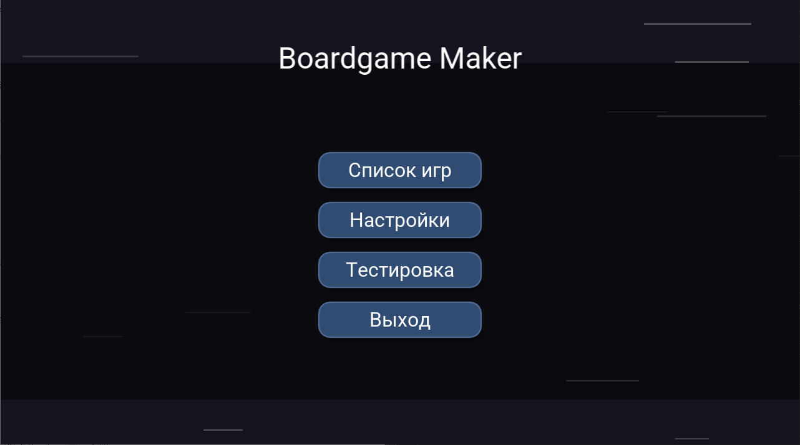
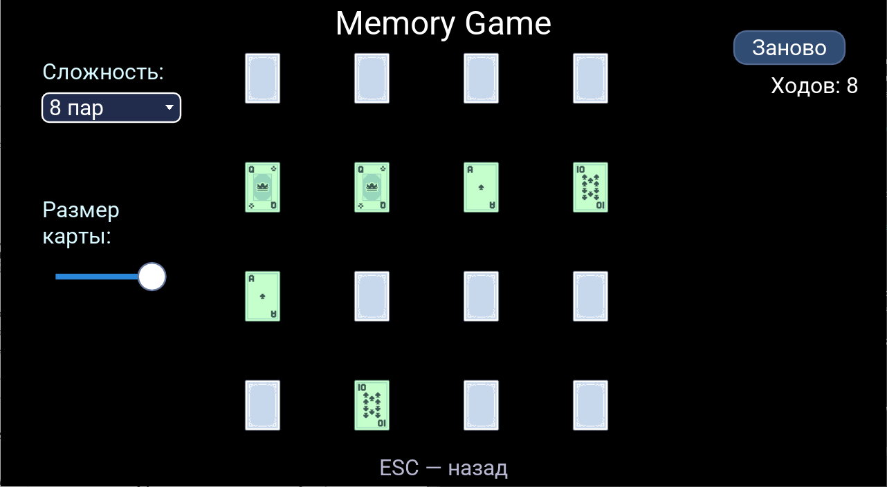
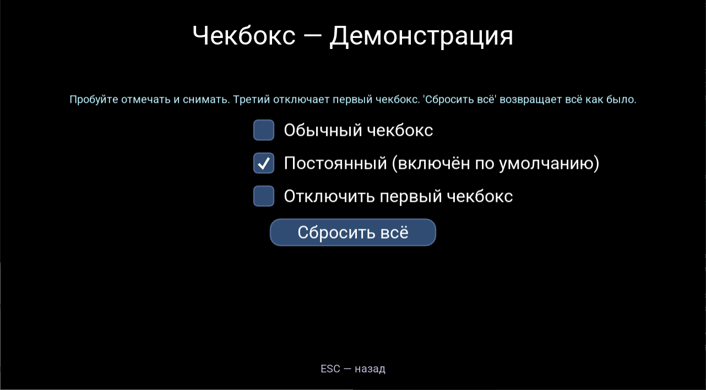

# Руководство пользователя

## Введение

**Boardgame Maker** — кроссплатформенное приложение для проектирования и тестирования настольных игр. Оно позволяет быстро создавать прототипы, настраивать игровые механики и запускать игры на любой платформе.

## Запуск приложения

- **Windows/macOS/Linux**:  
  1. Скачайте LOVE2D: https://love2d.org/  
  2. Перетащите файл `main.love` на исполняемый файл LOVE2D, либо запустите в терминале:  
     `love .`  
  3. Для запуска сборки (exe/app) — используйте инструкции из раздела [Архитектура и сборка](../README.md).

- **Android**:  
  1. Установите LOVE2D Player из Google Play.  
  2. Скопируйте файл `main.love` на устройство.  
  3. Откройте файл в LOVE2D Player.

- **iOS**:  
  1. Следуйте официальному гайду LOVE2D для iOS: https://love2d.org/wiki/Game_Distribution

## Основные сценарии

- **Создание новой игры:**  
  Откройте приложение, выберите пункт "Создать игру" и настройте правила, компоненты, поля и игроков через визуальный интерфейс.

- **Использование шаблонов:**  
  В разделе "Шаблоны" доступны базовые игры (21, Memory и др.), которые можно использовать как основу для собственных проектов.

- **Импорт/экспорт:**  
  Для обмена своими проектами используйте функции "Экспорт в файл" и "Импорт из файла" (меню "Файл").

- **Переключение языка:**  
  Откройте "Настройки" → "Язык". Выберите нужный язык (русский или английский).

## Описание интерфейса

- **Меню**: Запуск, Настройки, Список игр, Тесты, Выход.  
- **Песочница UI**: Тестирование интерфейсных компонентов (кнопки, слайдеры, чекбоксы и др.)  
- **Сцена игры**: Отображает игровое поле, доступные действия, состояние игроков.

## UI-компоненты

Песочница компонентов позволяет быстро протестировать поведение кнопок, чекбоксов, слайдеров и других элементов интерфейса. Это удобно для пользователей, дизайнеров и разработчиков.

## Частые вопросы

- **Как добавить свои ассеты?**  
  Скопируйте изображения в соответствующие папки (`assets/entities/cards`, `assets/ui/…`).

- **Как сбросить настройки?**  
  Удалите файл настроек в папке приложения.

- **Не работает звук?**  
  Проверьте наличие файлов в папке `assets/sounds/`.

